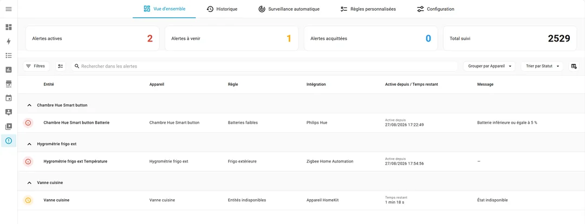
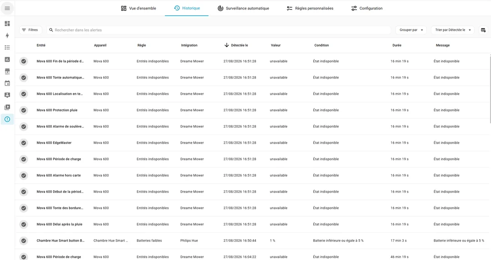
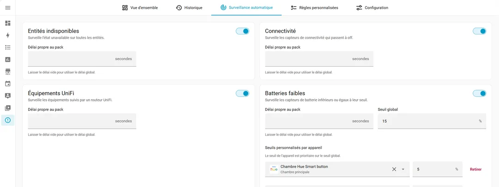
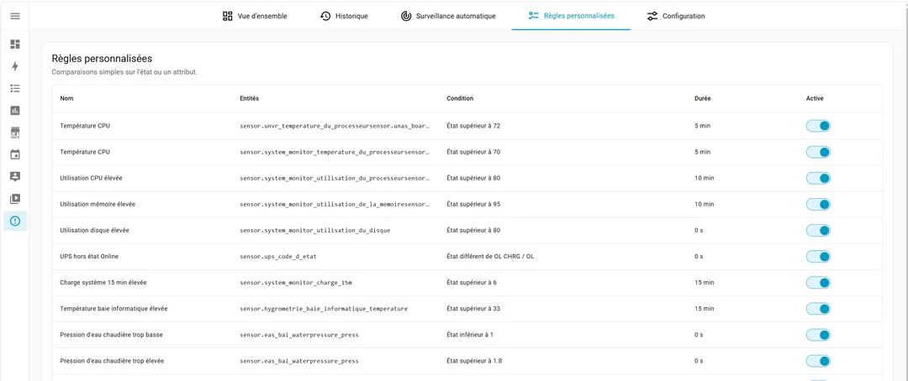
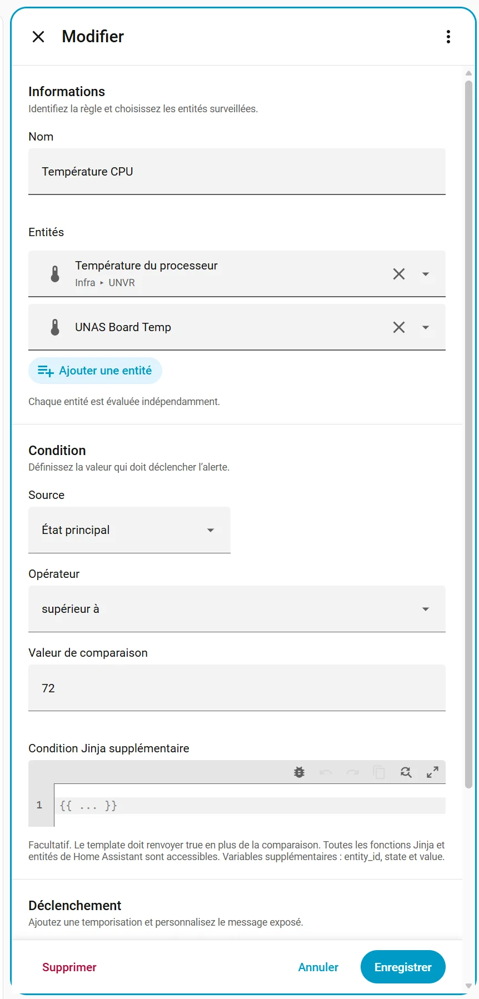
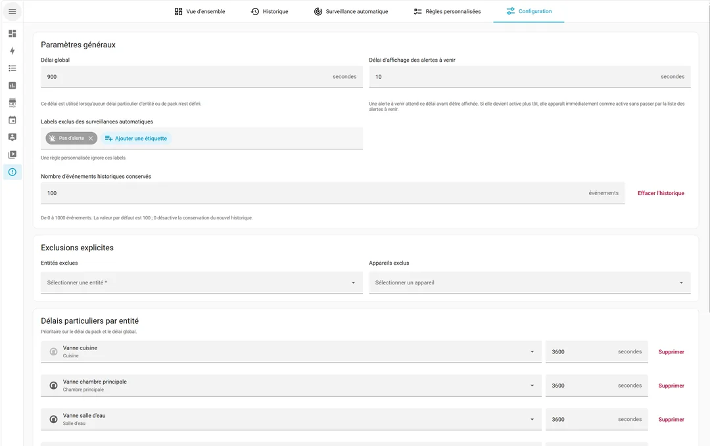

<p align="center">
  
</p>

<p align="center">
  🇬🇧 <a href="README.md">English</a> · 🇫🇷 <strong>Français</strong>
</p>

# Alert Manager pour Home Assistant

**Savoir quand quelque chose ne va pas dans Home Assistant — et garder le problème visible jusqu’à sa résolution.**

Alert Manager centralise les situations anormales de votre installation Home Assistant. Au lieu de maintenir de nombreux templates, automatisations, notifications et cartes de dashboard, vous définissez ce qui doit être considéré comme anormal et Alert Manager le suit pour vous.

Quelques exemples :

- une entité est `unavailable` depuis plus de 15 minutes ;
- une batterie passe sous 15 % ;
- un capteur de connectivité reste à `off` ;
- un appareil UniFi reste `not_home` ;
- un réfrigérateur consomme plus de 200 W pendant 2 heures ;
- la température d’un réfrigérateur reste au-dessus de 8 °C pendant 30 minutes ;
- n’importe quelle condition personnalisée basée sur un état, un attribut ou du Jinja.

La différence importante avec une simple notification : le problème **reste visible tant qu’il n’est pas résolu**.

## Ce que vous obtenez

- **Un tableau de bord central** avec les alertes actives, à venir et acquittées.
- **Une surveillance automatique** des entités indisponibles, de la connectivité, des batteries faibles et des appareils UniFi.
- **Des règles personnalisées** sur les états ou attributs des entités avec temporisation.
- **Des conditions et messages Jinja** basés sur les templates Home Assistant.
- **L’acquittement** d’une alerte sans perdre le suivi du problème réel.
- **Un historique** des alertes résolues.
- **Recherche, filtres, tri et groupement** directement dans le dashboard.
- **Des exclusions** par entité, appareil ou label.
- **Des délais par règle, entité ou globalement** pour éviter qu’un court incident devienne du bruit.
- **Des événements et capteurs Home Assistant** pour vos propres dashboards et automatisations.
- **Une surveillance événementielle**, sans polling global fréquent.
- **Une interface en français et en anglais**.

Alert Manager ne vous impose **aucun système de notification**. Les notifications restent de simples automatisations Home Assistant : vous choisissez qui notifier, comment et quand.

## Captures d’écran

### Vue d’ensemble

<p align="center">
  
</p>

<details>
<summary><strong>Voir plus de captures</strong></summary>

### Historique

<p align="center">
  
</p>

### Surveillance automatique

<p align="center">
  
</p>

### Règles personnalisées

<p align="center">
  
</p>

### Éditeur de règle

<p align="center">
  
</p>

### Configuration

<p align="center">
  
</p>

</details>

## Installation

### HACS

Tant qu’Alert Manager n’est pas disponible dans le catalogue HACS par défaut :

1. Ouvrez **HACS → Dépôts personnalisés**.
2. Ajoutez `https://github.com/zoic21/ha_alert_manager` comme **Integration**.
3. Installez **Alert Manager**.
4. Redémarrez Home Assistant.
5. Allez dans **Paramètres → Appareils et services → Ajouter une intégration** puis recherchez **Alert Manager**.

Le panneau **Alert Manager** apparaît ensuite dans la barre latérale de Home Assistant.

### Installation manuelle

1. Copiez `custom_components/alert_manager` dans `/config/custom_components/alert_manager`.
2. Redémarrez Home Assistant.
3. Ajoutez **Alert Manager** depuis **Paramètres → Appareils et services**.

Aucune ressource Lovelace et aucune configuration YAML ne sont nécessaires pour commencer.

## Être notifié sans être spammé

Alert Manager émet l’événement `alert_manager_device_alert_started` lorsqu’un appareil passe en alerte. Les alertes qui arrivent à peu d’intervalle pour le même appareil sont regroupées avant l’émission de l’événement, ce qui permet d’envoyer **une notification utile pour l’appareil au lieu d’une notification par règle**.

Exemple :

```yaml
alias: Notification Alert Manager
triggers:
  - trigger: event
    event_type: alert_manager_device_alert_started
actions:
  - action: script.notification
    metadata: {}
    data:
      title: '{{ trigger.event.data.device_name }} en alerte'
      message: |-
        
        - {{ message }}
        
      recipients:
        - loic
mode: queued
```

`script.notification` n’est qu’un exemple : remplacez-le par votre propre script de notification ou n’importe quelle action de notification Home Assistant.

## Surveillance automatique

Alert Manager peut surveiller automatiquement plusieurs problèmes courants :

| Surveillance | Condition d’alerte |
| --- | --- |
| Entités indisponibles | l’entité reste `unavailable` |
| Connectivité | un `binary_sensor` avec `device_class: connectivity` reste à `off` |
| Batterie faible | un capteur de batterie atteint le seuil configuré |
| UniFi | un `device_tracker` UniFi reste absent de `home` |

Chaque surveillance automatique peut être activée indépendamment et ajustée depuis l’interface.

## Règles personnalisées

Pour tout le reste, vous pouvez créer vos propres règles directement depuis le panneau Alert Manager.

Une règle peut :

- surveiller une ou plusieurs entités indépendamment ;
- utiliser l’état de l’entité ou l’un de ses attributs ;
- comparer avec `equals`, `not equals`, `contains`, `not contains`, `above` ou `below` ;
- demander que la condition reste vraie pendant une durée configurable ;
- ajouter une condition Jinja Home Assistant facultative ;
- choisir la source « Aucun » pour utiliser une condition Jinja obligatoire comme
  unique critère de déclenchement ;
- générer un message Jinja personnalisé avec les données des entités.

Cela couvre par exemple les températures anormales, la consommation électrique, l’âge d’une sauvegarde, des codes d’erreur ou presque n’importe quel état exposé par Home Assistant.

Les règles peuvent être éditées visuellement ou en YAML. La configuration complète d’Alert Manager peut également être exportée et importée en YAML.

## Alertes actives, à venir et acquittées

Alert Manager expose plusieurs entités afin que son état puisse aussi être utilisé en dehors du panneau intégré :

- `switch.alert_manager_main_monitoring`
- `sensor.alert_manager_main_active`
- `sensor.alert_manager_main_pending`
- `sensor.alert_manager_main_acknowledge`
- `sensor.alert_manager_device_main_active`

Vous pouvez ainsi facilement créer une carte conditionnelle sur votre dashboard principal, déclencher une automatisation de notification ou afficher un simple indicateur de santé de votre installation Home Assistant.

## Événements et actions

Événements utiles :

- `alert_manager_alert_started`
- `alert_manager_alert_resolved`
- `alert_manager_device_alert_started`
- `alert_manager_alert_acknowledged`
- `alert_manager_alert_unacknowledged`

L’acquittement est également disponible via :

- `alert_manager.acknowledge`
- `alert_manager.unacknowledge`

## Prérequis

- Home Assistant **2026.8 ou plus récent**.
- Une seule instance d’Alert Manager par installation Home Assistant.
- Un compte administrateur est nécessaire pour accéder au panneau Alert Manager.

Alert Manager est une intégration communautaire non officielle et n’est pas affiliée au projet Home Assistant.

## Retours et bêta-test

Alert Manager évolue activement et les installations réelles sont le meilleur moyen de trouver les cas limites.

Si vous le testez, les rapports de bug et cas d’usage sont les bienvenus dans les **[GitHub Issues](https://github.com/zoic21/ha_alert_manager/issues)**.

Si vous surveillez aujourd’hui quelque chose d’inhabituel avec un template ou une automatisation, n’hésitez pas à le décrire également : cela peut devenir une bonne candidate pour une future règle intégrée.
