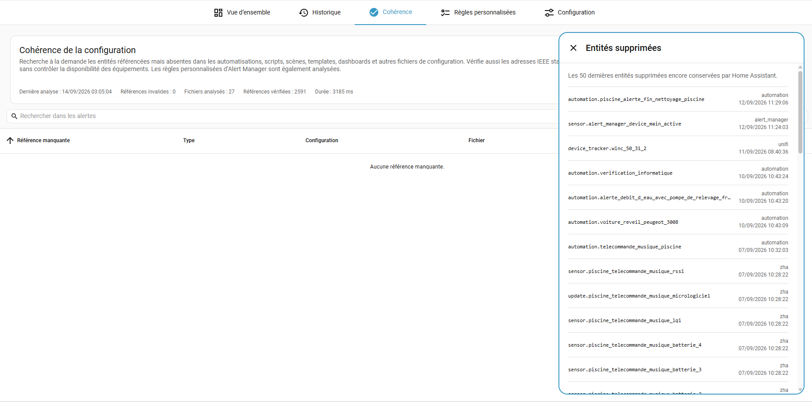

<p align="center">
  
</p>

<p align="center">
  🇬🇧 <a href="README.md">English</a> · 🇫🇷 <strong>Français</strong>
</p>

# Alert Manager pour Home Assistant

**Savoir quand quelque chose ne va pas dans Home Assistant — et garder le problème visible jusqu’à sa résolution.**

Alert Manager transforme les situations anormales de Home Assistant en problèmes que vous pouvez réellement suivre. Au lieu de répartir la logique entre templates, automatisations, notifications et cartes de dashboard, vous définissez ce qui n’est « pas normal » et Alert Manager le suit de sa détection jusqu’à sa résolution.

Il peut aussi rechercher les **références d’entités cassées dans votre configuration Home Assistant**, pratique pour retrouver les restes après le renommage ou la suppression d’une entité.

Quelques exemples :

- une entité est `unavailable` depuis plus de 15 minutes ;
- une batterie passe sous 15 % ;
- un capteur de connectivité reste à `off` ;
- un appareil UniFi reste `not_home` ;
- un réfrigérateur consomme plus de 200 W pendant 2 heures ;
- une température reste en dehors d’une plage attendue ;
- une valeur ou un attribut ne change plus depuis trop longtemps ;
- une automatisation ou un dashboard référence encore une entité qui n’existe plus ;
- n’importe quelle condition personnalisée basée sur un état, un attribut ou du Jinja.

La différence importante avec une simple notification : le problème **reste visible tant qu’il n’est pas résolu**.

## Ce qu’Alert Manager vous apporte

- **Un tableau de bord central** pour les alertes actives, à venir et acquittées.
- **Une surveillance automatique** des problèmes courants : entités indisponibles, connectivité, batteries faibles et appareils UniFi.
- **Des règles personnalisées puissantes** pour les états, attributs, plages de valeurs, absences de changement et conditions Jinja.
- **Une analyse de cohérence de la configuration** pour retrouver les références vers des entités disparues et revenir vers la configuration concernée lorsque c’est possible.
- **L’acquittement et l’historique** pour suivre un problème sans perdre de vue son état réel.
- **Recherche, filtres, tri, groupement et colonnes personnalisables**, avec une vue adaptée au mobile.
- **Des exclusions et temporisations** pour éviter que les situations normales ou les micro-coupures deviennent du bruit.
- **Des entités et événements Home Assistant** pour alimenter vos propres dashboards et automatisations de notification.
- **Une interface en français et en anglais**.

Alert Manager ne vous impose **aucun système de notification**. Les notifications restent de simples automatisations Home Assistant : vous choisissez qui notifier, comment et quand.

## Les nouveautés de la v2

### Analyse de cohérence

Une configuration Home Assistant évolue en permanence : entités renommées, intégrations supprimées, dashboards réorganisés… Il est facile de laisser une ancienne référence derrière soi et de ne la découvrir que bien plus tard.

Alert Manager v2 peut analyser votre configuration et signaler les références vers des entités qui n’existent plus. Le résultat indique l’objet concerné, le fichier et la ligne lorsqu’ils sont disponibles, avec un accès direct vers la page Home Assistant correspondante dès que possible.

L’analyse couvre la configuration Home Assistant, notamment les dashboards, automatisations, scripts, templates et blueprints, avec la possibilité d’inclure ou non ESPHome. Elle peut être lancée manuellement ou automatiquement, et le dernier résultat est conservé après un redémarrage afin de toujours savoir quand l’installation a été vérifiée pour la dernière fois.

Les références particulières connues peuvent être ignorées si nécessaire, tandis que les références dynamiques sont volontairement écartées autant que possible afin de limiter les faux positifs.

### Des règles personnalisées beaucoup plus expressives

Les règles personnalisées couvrent désormais davantage de cas concrets sans devoir créer au préalable un template sensor ou une automatisation dédiée :

- égalité, différence et recherche de texte ;
- seuils numériques, plages **entre** deux valeurs ou **en dehors** de ces bornes ;
- plusieurs valeurs acceptées ;
- attributs imbriqués et tableaux comme `data.*.key` ;
- variation de l’état principal ou d’un attribut numérique depuis une valeur de début capturée lorsqu’une condition Jinja obligatoire devient vraie ;
- alerte lorsque **l’entité entière ne change plus** ;
- alerte lorsque seul **un état ou un attribut précis ne change plus** ;
- Jinja comme condition complémentaire ou comme logique complète de la règle ;
- messages Jinja personnalisés, avec mise à jour facultative pendant que l’alerte est active.

Une règle peut surveiller plusieurs entités indépendamment, utiliser sa propre temporisation, être éditée visuellement ou en YAML et être dupliquée lorsqu’une règle proche est nécessaire.
En YAML, les règles entièrement basées sur Jinja utilisent désormais la valeur explicite `source: jinja` ; les règles existantes en `source: none` sont migrées automatiquement.

### Une interface plus agréable au quotidien

La liste principale met d’abord l’accent sur les problèmes actifs et reprend les contrôles de tableau de Home Assistant pour la recherche, les filtres, le tri, le groupement et le choix des colonnes visibles. Les pages des règles personnalisées et de cohérence suivent la même logique, tandis que l’affichage mobile conserve les informations essentielles sans perdre l’accès aux détails.

## Captures d’écran

### Vue d’ensemble

<p align="center">
  
</p>

<details>
<summary><strong>Voir plus de captures</strong></summary>

### Historique

<p align="center">
  
</p>

### Surveillance automatique

<p align="center">
  
</p>

### Règles personnalisées

<p align="center">
  
</p>

### Analyse de cohérence

<p align="center">
  
</p>

### Éditeur de règle

<p align="center">
  
</p>

### Configuration

<p align="center">
  
</p>

</details>

## Installation

### HACS

Tant qu’Alert Manager n’est pas disponible dans le catalogue HACS par défaut :

1. Ouvrez **HACS → Dépôts personnalisés**.
2. Ajoutez `https://github.com/zoic21/ha_alert_manager` comme **Integration**.
3. Installez **Alert Manager**.
4. Redémarrez Home Assistant.
5. Allez dans **Paramètres → Appareils et services → Ajouter une intégration** puis recherchez **Alert Manager**.

Le panneau **Alert Manager** apparaît ensuite dans la barre latérale de Home Assistant.

### Installation manuelle

1. Copiez `custom_components/alert_manager` dans `/config/custom_components/alert_manager`.
2. Redémarrez Home Assistant.
3. Ajoutez **Alert Manager** depuis **Paramètres → Appareils et services**.

Aucune ressource Lovelace et aucune configuration YAML ne sont nécessaires pour commencer.

## Surveillance automatique

Alert Manager peut surveiller automatiquement plusieurs problèmes courants :

| Surveillance | Condition d’alerte |
| --- | --- |
| Entités indisponibles | l’entité reste `unavailable` |
| Connectivité | un `binary_sensor` avec `device_class: connectivity` reste à `off` |
| Batterie faible | un capteur de batterie atteint le seuil configuré |
| UniFi | un `device_tracker` UniFi reste absent de `home` |

Chaque surveillance peut être activée indépendamment. Les délais et exclusions se règlent depuis l’interface, et les seuils de batterie peuvent être adaptés lorsque certains appareils ont besoin de limites différentes.

## Règles personnalisées

Pour tout le reste, vous pouvez créer vos propres règles directement depuis le panneau Alert Manager.

Une règle peut surveiller une ou plusieurs entités indépendamment et utiliser l’état de l’entité, un attribut, la variation de l’état principal ou d’un attribut numérique depuis une valeur de début définie par une condition, une condition d’absence de changement ou une logique entièrement basée sur Jinja. Les temporisations permettent d’exiger qu’une situation persiste avant de devenir une alerte, afin qu’une courte anomalie ne remplisse pas inutilement le dashboard.

Cela couvre par exemple les températures anormales, les consommations électriques inhabituelles, l’âge d’une sauvegarde, les codes d’erreur, les capteurs qui ne se mettent plus à jour ou presque n’importe quel état exposé par Home Assistant.

Les règles peuvent être éditées visuellement ou en YAML. La configuration complète d’Alert Manager peut également être exportée et importée en YAML.

### Exemples

#### Un thermostat qui chauffe sans réchauffer la pièce

Lorsque le thermostat commence à chauffer, la condition Jinja devient vraie et Alert Manager mémorise la température initiale. Après deux heures, la règle déclenche une alerte si la pièce a gagné moins de 0,2 °C. Dans le message, value correspond à la variation de température mesurée.

```yaml
name: "Thermostat : surveillance"
enabled: true
entity_ids:
  - "climate.tado_smart_thermostat_su0582429440"
source: "attribute_variation"
attribute: "current_temperature"
operator: "below"
value: "0.2"
duration: 7200
message: "Le chauffage {{ state_attr(entity_id, 'friendly_name') }} est en marche depuis 2 h, mais la température n'a augmenté que de {{ value | float(0) | round(1) }} °C."
update_message_when_active: false
condition_template: "{{ state.state == 'heating' }}"
```

#### Messages Bayrol en ignorant les états attendus

Cette règle évalue chaque clé de message du tableau data de Bayrol. Elle ne peut devenir active que lorsqu’aucun des états attendus de débit, de démarrage ou de mode enjoy n’est présent ; sa condition Jinja impose aussi que le débit soit présent. Le message Jinja filtre les textes renvoyés et ne conserve l’alerte redox basse que lorsque la température de la piscine dépasse 15 °C.

```yaml
name: "Alerte Bayrol"
enabled: true
entity_ids:
  - "sensor.bayrol_24ase2_16263_messages"
source: "attribute"
attribute: "data.*.key"
operator: "not_contains"
value:
  - "al_no_flow_bnc"
  - "al_start_delay"
  - "enjoy"
duration: 5400
message: "                                                  {{ item.message | replace(\"\\n\",\" \") }}                                                     {{ item.message | replace(\"\\n\",\" \") }}                                    "
update_message_when_active: false
condition_template: "\n{{ (flow == 'on') }}"
```

## Analyse de cohérence

La page **Cohérence** compare les références statiques d’entités trouvées dans votre configuration Home Assistant avec les entités réellement présentes.

Lorsqu’un problème est trouvé, Alert Manager indique d’où il vient et permet, lorsque c’est possible, d’ouvrir directement l’automatisation, le script, le dashboard, le template ou l’autre objet Home Assistant concerné. Les résultats sont conservés entre les redémarrages et sont également exposés via `sensor.alert_manager_coherence_issue`, ce qui permet de surveiller l’échec d’un contrôle de cohérence comme n’importe quel autre problème.

Les analyses peuvent être lancées à la demande ou automatiquement chaque jour, chaque semaine ou chaque mois. L’analyse du dossier ESPHome peut être désactivée et certaines références connues peuvent être ignorées depuis la configuration.

## Cycle de vie d’une alerte

Une alerte peut être :

- **À venir** tant que sa temporisation est encore en cours ;
- **Active** lorsque la condition est présente depuis suffisamment longtemps ;
- **Acquittée** lorsque vous avez pris connaissance du problème mais qu’il n’est pas encore résolu ;
- **Résolue** lorsque la condition anormale disparaît.

Les alertes résolues peuvent être conservées dans l’historique, ce qui permet de repérer les problèmes récurrents au lieu de seulement voir ce qui ne va pas à l’instant présent.

## Être notifié sans être spammé

Alert Manager émet l’événement `alert_manager_device_alert_started` lorsqu’un appareil passe en alerte. Les alertes qui arrivent à peu d’intervalle pour le même appareil sont regroupées avant l’émission de l’événement, ce qui permet d’envoyer **une notification utile pour l’appareil au lieu d’une notification par règle**.

Exemple :

```yaml
alias: Notification Alert Manager
triggers:
  - trigger: event
    event_type: alert_manager_device_alert_started
actions:
  - action: script.notification
    metadata: {}
    data:
      title: '{{ trigger.event.data.device_name }} en alerte'
      message: |-
        
        - {{ message }}
        
      recipients:
        - loic
mode: queued
```

`script.notification` n’est qu’un exemple : remplacez-le par votre propre script de notification ou n’importe quelle action de notification Home Assistant.

## Entités et événements Home Assistant

Alert Manager expose plusieurs entités afin que son état puisse aussi être utilisé en dehors du panneau intégré :

- `switch.alert_manager_main_monitoring`
- `sensor.alert_manager_main_active`
- `sensor.alert_manager_main_pending`
- `sensor.alert_manager_main_acknowledge`
- `sensor.alert_manager_device_main_active`
- `sensor.alert_manager_coherence_issue`

Événements utiles :

- `alert_manager_alert_started`
- `alert_manager_alert_resolved`
- `alert_manager_device_alert_started`
- `alert_manager_alert_acknowledged`
- `alert_manager_alert_unacknowledged`

L’acquittement est également disponible via `alert_manager.acknowledge` et `alert_manager.unacknowledge`.

## Prérequis

- Home Assistant **2026.8 ou plus récent**.
- Une seule instance d’Alert Manager par installation Home Assistant.
- Un compte administrateur est nécessaire pour accéder au panneau Alert Manager.

Alert Manager est une intégration communautaire non officielle et n’est pas affiliée au projet Home Assistant.

## Note

Ce code a été ecrit en partie avec l'aide d'une IA

## Retours

Alert Manager évolue activement et les installations réelles sont le meilleur moyen de trouver les cas limites.

Les rapports de bug, idées et cas de surveillance inhabituels sont les bienvenus dans les **[GitHub Issues](https://github.com/zoic21/ha_alert_manager/issues)**.
