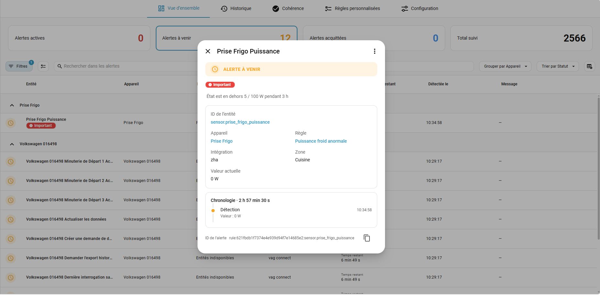
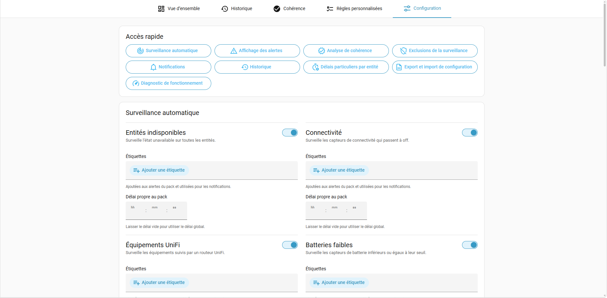

<p align="center">
  
</p>

<p align="center">
  🇬🇧 <a href="README.md">English</a> · 🇫🇷 <strong>Français</strong>
</p>

# Alert Manager pour Home Assistant

**Savoir quand quelque chose ne va pas — et garder le problème visible jusqu’à sa résolution.**

Alert Manager rassemble les problèmes de Home Assistant : équipements indisponibles, batteries faibles, automatisations en erreur, valeurs anormales ou références cassées dans la configuration. Chaque alerte est suivie de sa détection à sa résolution, plutôt que de se limiter à une notification facile à manquer.

Utilisez la surveillance automatique pour les problèmes courants et les règles personnalisées pour vos équipements. Un problème reste visible tant qu’il nécessite votre attention ; l’acquitter indique que vous en avez connaissance, pas qu’il est corrigé. Les occurrences résolues peuvent être conservées dans l’historique pour repérer les problèmes récurrents.

[Installation](#installation) · [Documentation](docs/user-guide.md) · [Signaler un problème](https://github.com/zoic21/ha_alert_manager/issues)

<p align="center">
  
</p>

## Possibilités

### Surveiller automatiquement les problèmes courants

Activez les packs d’entités indisponibles, pertes de connectivité, batteries faibles, équipements UniFi absents, mises à jour disponibles, erreurs d’exécution d’automatisation/script et instabilités répétées. Chaque pack dispose de ses paramètres et étiquettes. Adaptez les délais, seuils et exceptions par appareil ou entité selon le pack, depuis un éditeur visuel compact ou en YAML. Les exceptions peuvent désactiver une surveillance ; les exclusions globales par étiquette restent disponibles. Le pack de mises à jour suit les entités `update` de Home Assistant et permet d’exclure celles de votre choix.

Depuis une alerte automatique, ouvrez directement la configuration de la surveillance concernée. Les exceptions se replient en résumés pour garder les configurations longues lisibles.

Tout se configure depuis le panneau. Les étiquettes servent à organiser les alertes et sélectionner les notifications ; les entités de surveillance et événements restent disponibles pour vos propres automatisations.

### Définir des règles propres à votre installation

Surveillez un réfrigérateur consommant plus de 200 W pendant deux heures, une température hors plage, un chauffage sans hausse de température suffisante, un capteur qui ne change plus ou la fin d’un cycle d’appareil.

Les règles prennent en charge états, attributs imbriqués, comparaisons numériques et textuelles, absence de changement, variations, transitions, séquences ordonnées et conditions Jinja. Une règle peut surveiller plusieurs entités indépendamment. Éditez visuellement ou en YAML, dupliquez une règle et testez un brouillon sur les valeurs réelles, avec les profils de notification correspondants. Les messages Jinja expliquent le problème et peuvent rester actualisés tant que l’alerte est active.

Les séquences reconnaissent de 2 à 20 étapes sur la même valeur, avec un maintien minimum, une sortie avant une limite ou une durée comprise entre deux bornes, et un délai total facultatif. Les étapes sont repliables, désactivables individuellement et réordonnables par glisser-déposer ou au clavier. Dès le maintien de la première étape, la séquence apparaît dans les alertes à venir avec sa progression et le temps restant. Une progression abandonnée ou expirée disparaît sans historique ni notification de résolution. Les séquences inachevées repartent d’une nouvelle observation après un redémarrage, sans compter le temps d’arrêt.

Transitions et séquences proposent trois modes de résolution : après une durée, lorsque la valeur d’arrivée ou la dernière étape activée n’est plus vraie, ou selon une comparaison de valeur distincte. La résolution par état ou condition peut notifier le retour à la normale ; l’expiration automatique reste silencieuse. Le [guide des règles](docs/custom-rules.md) détaille les durées, la progression et les exemples YAML.

### Suivre les alertes du dashboard à l’historique

L’Accueil distingue les alertes actives, à venir et acquittées, avec recherche, filtres, tri, groupement par équipement, colonnes personnalisables et sélection multiple. Ouvrez une alerte pour consulter ses valeurs au déclenchement et actuelles, ses notifications et ses occurrences précédentes. L’acquittement peut être illimité ou temporaire. Les 10 derniers acquittements et désacquittements (y compris les expirations automatiques) sont horodatés dans la chronologie et conservés après résolution et redémarrage ; le plus ancien est supprimé au-delà de cette limite.

Une chronologie toujours visible rassemble détection, activation, acquittements, résolution, valeurs et horodatages des étapes de séquence, occurrences d’instabilité et envois de notifications. Les notifications de début et de résolution affichent leur horaire et leur profil ; les rappels sont regroupés par nombre et profils. Les utilisateurs et automatisations sont identifiés lorsqu’ils sont connus. Les événements du jour affichent seulement l’heure ; les autres conservent leur date.

La carte de dashboard intégrée propose une vue compacte regroupée par équipement. Choisissez les limites desktop/mobile, le tri, les labels à afficher ou masquer, l’ancienneté et le regroupement facultatifs, l’alignement et la couleur des icônes ; elle se masque sans alerte correspondante et ouvre les détails au clic. L’Historique permet de consulter les occurrences résolues et leurs statistiques de récurrence : alertes fréquentes, équipements touchés et durées actives cumulées.

### Choisir les notifications et vérifier la configuration

Les profils de notification intégrés et facultatifs gèrent plusieurs destinataires `notify`, les nouvelles alertes, les retours à la normale, les rappels et le regroupement des envois. Sélectionnez les alertes par étiquette et définissez des exceptions ordonnées ; les étiquettes de l’entité, de l’appareil et de la règle ou du pack participent à la sélection. La première exception dont toutes les étiquettes correspondent s’applique. Les profils peuvent être testés, dupliqués et édités en YAML. Les notifications Companion prises en charge ouvrent l’alerte ou la vue concernée au toucher. Vos automatisations basées sur les événements restent utilisables.

L’analyse de cohérence retrouve les références statiques vers des entités et appareils ZHA absents dans les sources de configuration prises en charge. Lancez-la à la demande ou selon un planning, ouvrez la configuration concernée lorsque c’est possible et conservez éventuellement une alerte tant que des problèmes subsistent. L’import/export YAML et les sauvegardes automatiques permettent aussi de récupérer la configuration.

### Consulter les diagnostics de fonctionnement

La configuration présente les évaluations de règles, leurs temps de traitement, les transitions d’alertes et les envois de notifications sur 24 tranches horaires, conservées uniquement en mémoire et réinitialisées au redémarrage.

La détection repose sur les événements Home Assistant. Une vérification de sécurité toutes les 10 minutes contrôle aussi les états des entités déjà suivies, sans demander leur actualisation ni reconstituer les transitions manquées. Une condition nouvellement détectée commence à l’heure du contrôle. Le compteur de rattrapages dans les diagnostics permet de voir si cette vérification a corrigé des écarts.

L’interface est disponible en **français et en anglais**, sur ordinateur et mobile. Tous les utilisateurs connectés peuvent consulter la carte, l’Accueil et l’Historique ; la configuration et toutes les actions, dont l’acquittement, sont réservées aux administrateurs.

<details>
<summary><strong>Voir plus de captures</strong></summary>

### Carte de dashboard


### Alertes à venir



### Historique


### Règles personnalisées


### Cohérence de la configuration


### Configuration



</details>

## Installation

Nécessite **Home Assistant 2026.8 ou ultérieur**. Une seule instance d’Alert Manager est prise en charge par installation Home Assistant.

### HACS

1. Dans **HACS → Dépôts personnalisés**, ajoutez `https://github.com/zoic21/ha_alert_manager` avec la catégorie **Integration**.
2. Installez **Alert Manager**, puis redémarrez Home Assistant.
3. Ouvrez **Paramètres → Appareils et services → Ajouter une intégration**, puis recherchez **Alert Manager**.

Le panneau apparaît dans la barre latérale de Home Assistant. Aucune configuration YAML n’est nécessaire.

<details>
<summary>Installation manuelle</summary>

Copiez `custom_components/alert_manager` dans `/config/custom_components/alert_manager`, redémarrez Home Assistant, puis ajoutez **Alert Manager** depuis **Paramètres → Appareils et services**.

</details>

### Ajouter la carte de dashboard

Choisissez **Alert Manager** dans le sélecteur de cartes du dashboard. Aucune installation frontend séparée ni ressource Lovelace manuelle n’est nécessaire ; actualisez le navigateur après une installation ou une mise à jour.

```yaml
type: custom:alert-manager-card
max_tiles: 5
alignment: left
```

## Documentation

Commencez dans **Configuration → Surveillance automatique**, vérifiez les packs activés et leurs délais, puis ajoutez des règles propres à votre installation. Les profils de notification sont facultatifs.

La documentation détaillée est maintenue **uniquement en anglais** :

| Guide | Contenu |
| --- | --- |
| [Règles personnalisées](docs/custom-rules.md) | Opérations, attributs, Jinja, variations, transitions, séquences, testeur et exemples YAML. |
| [Configuration](docs/configuration.md) | Packs, délais, exclusions, profils de notification, YAML, sauvegardes et diagnostics. |
| [Cohérence de la configuration](docs/coherence.md) | Références, vérifications ZHA, exclusions, planification et alertes de cohérence. |
| [Dashboard et historique](docs/dashboard-and-history.md) | Accueil, carte, acquittement, démarrage, historique et statistiques de récurrence. |

L’[index de documentation](docs/user-guide.md) donne accès aux quatre guides. La documentation suit la branche consultée ; utilisez la branche de release ou le tag correspondant à votre version installée.

Questions, bugs et idées de surveillance sont les bienvenus dans les **[issues GitHub](https://github.com/zoic21/ha_alert_manager/issues)**.

Alert Manager est une intégration communautaire non officielle, sans affiliation avec Home Assistant. Ce code a été écrit en partie avec l’aide de l’IA.
