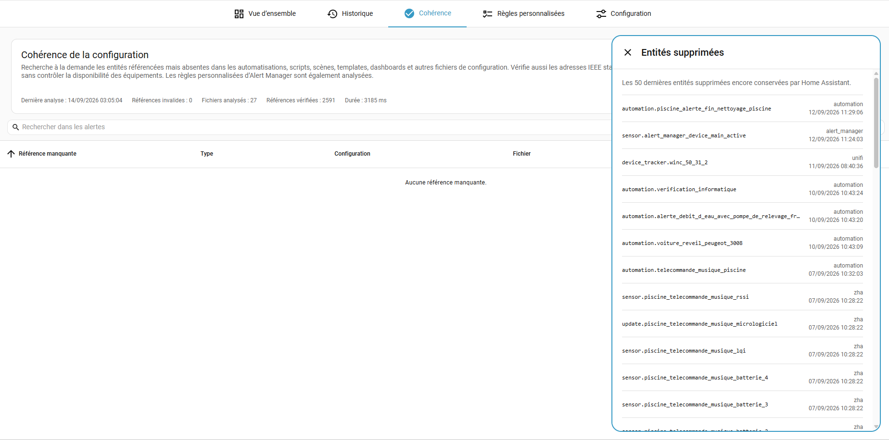

# Configuration coherence

[Documentation](user-guide.md) · [Custom rules](custom-rules.md) · [Configuration](configuration.md) · [Dashboard and history](dashboard-and-history.md)

**Coherence** finds configuration that still points to an entity or ZHA device that no longer exists. It is useful after renaming or removing entities, replacing equipment or reorganizing automations. It checks references, not whether equipment is currently online.

## Run a scan

Open **Coherence** and start an analysis. The results identify the missing reference and its source. When a matching Home Assistant editor or object is available, **Open** takes you there; a finding in a custom rule opens that rule's editor.

Reports are kept between restarts. Changing the configuration does not itself mean that a stored finding has been checked again: run another scan after correcting the reference.

## What is checked

| Source | Coverage |
| --- | --- |
| Automations and scripts | Static entity references, including supported template references. |
| Dashboards and templates | Static references found by the configuration scanner. |
| ESPHome | References in the scanned configuration when ESPHome scanning is enabled. |
| Custom rules | Selected entities and static references in Jinja conditions/messages, including disabled rules. |
| ZHA event triggers | Static `device_ieee` references in `zha_event` triggers and script/automation `wait_for_trigger` steps. |

Custom rules are checked from an in-memory snapshot and do not increase the scanned-file count. Dynamic references and plain message text are skipped: the scanner does not try to execute a template to guess every entity it might use.

This is a reference check, **not a full configuration validator**. A report without findings does not prove that every automation works or that every dynamically constructed reference is valid.

### ZHA device checks

When ZHA is fully loaded, static IEEE addresses are compared against Home Assistant's **ZHA device registry**. Modern and legacy trigger syntax are supported.

This checks registered devices, **not current availability or radio-network membership**. Disabled devices, remotes without entities and stale registered devices still count as present. Devices registered only with another Zigbee integration do not satisfy a ZHA reference.

Templates, blueprint inputs and malformed IEEE values are skipped; blueprints are not expanded. If ZHA is absent, its check is not applicable. Incomplete setup or unavailable metadata produces a skipped check, not a list of missing devices.

## Scheduling and exclusions

In **Configuration → Coherence analysis**, choose manual-only analysis or a **daily, weekly or monthly** schedule. ESPHome scanning can be disabled independently.

The `bubble_card` directory and its subdirectories are excluded from file scanning to avoid false positives from module code and example entity references. Dashboard configurations outside that directory are still checked.

Use the reference exclusions for known or intentional references. An exact ZHA IEEE address can be excluded through the same mechanism. These exclusions concern coherence findings; they are separate from the labels and exclusions used by automatic alert monitoring.

## Keep an alert while findings remain

Enable **Create an alert for coherence issues** in **Configuration → Coherence analysis** to maintain one immediate alert while findings remain. The option is off by default and is available as `coherence_alert_enabled` in configuration YAML.

The alert uses the ordinary acknowledgement, history and notification profiles. Continuing findings update the same alert instead of creating one alert per missing reference.

Only a **complete check confirming recovery** resolves it. Failed or incomplete scans cannot clear an existing coherence alert. Enabling the option uses the latest report without starting a scan; disabling removes the alert and reminders without sending a recovery notification.

Findings are also exposed through `sensor.alert_manager_coherence_issue` for your own dashboards and automations.

## Deleted entities

The page provides the latest **50 deleted entities** still retained by Home Assistant, including deletion date and integration. This comes directly from Home Assistant's entity registry; Alert Manager does not maintain a separate deletion history. It can help explain a missing reference, but is not an unlimited record of everything ever deleted.

## Export all Home Assistant entities

Below **Deleted entities**, **Export entities (JSON)** downloads a private,
versioned JSON snapshot. It is available to administrators, even before the first
coherence scan. It does not run a scan or change any entity, alert or configuration.

The export combines the entity registry and current HA states, including entities
outside dashboards, disabled/hidden entities and entities without a unique ID.
Registered devices contain their entities; `entities_without_device` contains the
rest. Devices without entities are included. Deleted registry entries are excluded.

The root contains `schema_version`, `exported_at`, Home Assistant and Alert Manager
versions, counts, `devices` and `entities_without_device`. Each entity includes its
ID, name, integration platform, config-entry ID, unique ID, category, labels, explicit
and effective area, state, full attributes, and change/update/report timestamps.
Device metadata includes name, manufacturer, model, software/hardware versions,
area, labels and integrations. Devices, entities and labels are sorted by ID for
repeatable comparisons; attribute arrays retain their original order.

| Field | Meaning |
| --- | --- |
| `disabled` / `disabled_by` | Registry disable flag and reason (`user`, `integration`, `device`, `config_entry`, etc.). Available for both devices and registered entities. |
| `hidden` / `hidden_by` | Registry hiding flag and reason for entities. HA has no device-level hiding flag, so both are `null` for devices. |
| `registered` | Whether the entity exists in the entity registry. For state-only entities, registry flags and integration are `null` when unknown. |
| `state` / `attributes` | Raw HA state string and all published attributes, preserving JSON types. Both are `null` when HA has no state; actual `unknown` and `unavailable` strings are preserved. |
| `area` / `effective_area` | The entity's explicit area and the area after inheriting from its device. |

Disabled, hidden, unavailable and an ordinary `off` state are different concepts.
A device's disable flag is exported separately from each entity's own registry flag;
visibility is never guessed from whether its entities appear on a dashboard.

The snapshot reflects the **last values known to HA**, not a forced refresh of the
equipment. Capture happens before yielding to a worker; grouping and JSON encoding
run off the event loop. Nothing is polled or saved on the server. The filename and
export timestamp use UTC (`Z` or `+00:00`). No historical values, integration
credentials/configuration or import/restore mechanism are included. Published state
attributes themselves can contain locations, URLs or tokens: keep the file private.
If an attribute cannot be encoded as JSON, the export fails visibly rather than
silently dropping data or downloading an incomplete inventory.

## Working through findings

Open the affected automation, script, dashboard or custom rule and check whether the reference should be replaced or removed. Exclude it only when it is intentional. Run the scan again to validate the correction; an unresolved or incomplete check must not be mistaken for a confirmed recovery.
