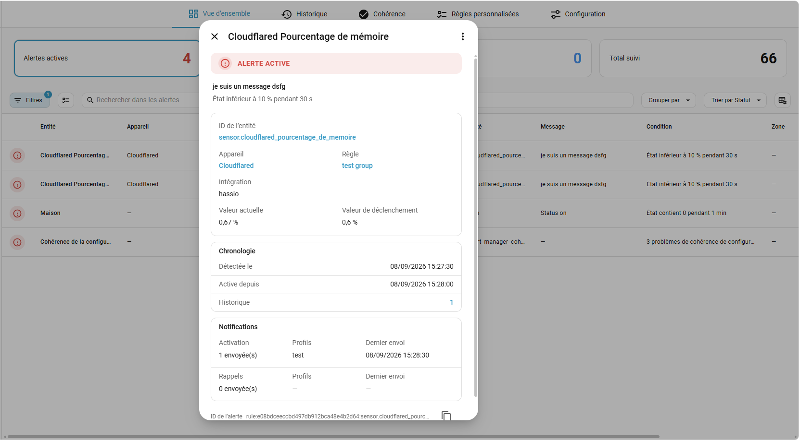
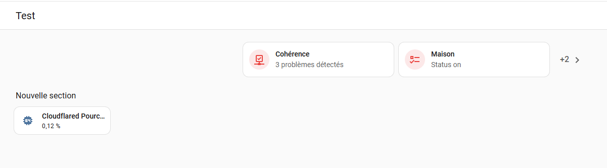
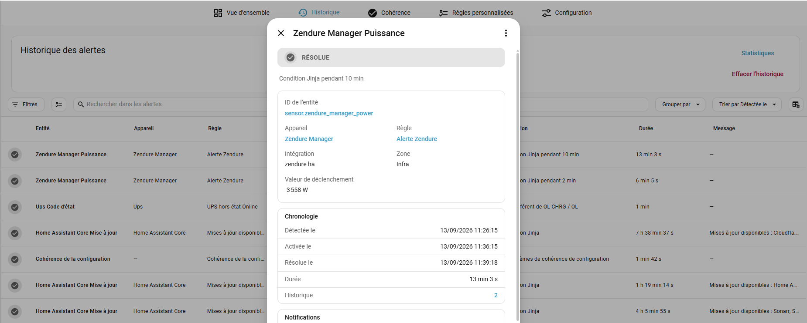

# Dashboard and history

[Documentation](user-guide.md) · [Custom rules](custom-rules.md) · [Configuration](configuration.md) · [Coherence](coherence.md)

Use **Overview** to see what needs attention now, the dashboard card for a compact view elsewhere in Home Assistant, and **History** to understand resolved and recurring problems.

## Overview and alert states

An ongoing alert is **Upcoming**, **Active** or **Acknowledged**. Upcoming means its trigger delay is still running; Active means the condition has been confirmed. Acknowledging an alert records that the problem is known, but does not fix or hide it. Acknowledged alerts do not contribute to the active count.

When a condition clears, the alert is resolved and can be retained in History. A pending condition that disappears before activation does not enter history. Transition rules have their own [automatic expiration behavior](custom-rules.md#transitions-and-automatic-resolution).



Tables support search, filters, sorting, device grouping, customizable columns and multiple selection. Open an alert to see its triggering and current values, contextual access to the entity, notification deliveries and previous occurrences. Numeric display follows Home Assistant's entity precision and the user's number format without changing stored values.

Alert details show Home Assistant labels below the status, including labels from the
rule or automatic pack, entity and device. Active, pending and acknowledged alerts
use current labels. On resolution, their IDs, names, colors and icons are saved in
history and retained across restarts, even if a label is later edited or deleted.
Older history entries retain only the label information originally recorded.

A clickable previous-occurrence count opens History filtered to the same stable alert ID. The filter can be changed or cleared. Flapping alerts also show their count/threshold and a collapsible list of retained occurrence times.

### Reevaluate an alert

**Reevaluate** in an ongoing alert's details menu checks its entity's current state again, including its other alerts. It preserves normal delays and protections and uses the ordinary resolution/history/notification flow. Monitoring must be enabled and startup complete.

### Acknowledge temporarily

The details menu offers **Acknowledge temporarily…** for 15 min, 30 min, 1 h, 24 h or a custom duration up to one year. Details show the remaining time; clicking it reveals the exact deadline. Regular acknowledgement has no time limit.

At expiry, an ongoing alert becomes active again with the same identity and start time. Profiles allowing new-alert notifications can notify again even without reminders configured. Resolution or manual unacknowledgement cancels the deadline.

Deadlines survive restarts and are handled after startup reconciliation. Pausing monitoring does not shift them; expiry handling waits until monitoring resumes.

## Add the dashboard card

Choose **Alert Manager** in the dashboard card picker. The integration registers the card: no additional HACS frontend installation or manual Lovelace resource is required. Refresh the browser after installation or an update.



```yaml
type: custom:alert-manager-card
max_tiles: 5
alignment: left
# icon_color: red
# max_tiles_mobile: 2
# labels: [home, outdoors]
# exclude_labels: [maintenance]
# sort: oldest
# show_age: true
# group_by_device: false
```

| Option | Behavior |
| --- | --- |
| `max_tiles` | Maximum tile count, from 1 to 100; default 5. |
| `max_tiles_mobile` | Optional mobile limit, from 1 to 100; when absent or cleared, uses `max_tiles`. |
| `sort` | `newest` (default), `oldest` or `alphabetical`, by the displayed name. |
| `labels` | Include alerts matching any selected label ID; an empty list includes all labels. |
| `exclude_labels` | Exclude alerts matching any selected label ID; exclusion takes precedence. |
| `show_age` | Show localized relative activation time next to the message; default `false`. |
| `group_by_device` | Group matching alerts by device; default `true`. Without a device, each alert remains separate. |
| `alignment` | `left`, `center` or `right`; default `left`. |
| `icon_color` | Optional color from Home Assistant's native palette; the theme applies when omitted. |
| `label` | Legacy single label ID, normalized to `labels` when read. An explicit `labels` list takes precedence. |

These settings belong to each card and are also available in the native visual editor. They do not change monitoring, notifications, global counters or History. Label filtering uses the existing alert-label resolution and runs before grouping. A filtered-out alert never contributes to a group, its count, age or sorting.

Sorting runs before the tile limit. Grouped cards use the newest or oldest retained activation time for date sorting; equal values are ordered by stable identifiers. Updating an alert message does not change its activation date. Alphabetical sorting follows the Home Assistant language and the displayed name.

When enabled, age uses the oldest active, unacknowledged alert retained in the tile, regardless of sort order. Invalid or missing dates do not produce an age. Home Assistant's native relative-time component updates the display without backend polling.

A single-alert tile opens its details; a grouped tile opens the device-filtered list. The **+N** bubble counts remaining **tiles** after filtering and grouping: devices in grouped mode (with separate tiles for alerts without a device), or alerts in individual mode. Group and overflow links preserve label inclusions and exclusions; these filters can be cleared in Overview.

The mobile limit uses the same **600 px viewport breakpoint** as the layout and responds to width/orientation changes. A limit of two does not force two tiles side by side: mobile keeps one tile per row. Tiles are capped at 300 px on wider screens. The overflow bubble and hourglass do not consume a tile slot.

### Visibility, startup and mobile layout

With no matching alerts, the card and its wrapper hide in standard Sections and Masonry views; custom layouts may behave differently.

During startup, known active alerts remain visible with an **hourglass** while they are reevaluated. The hourglass shares the overflow bubble and opens the filtered Overview. On mobile, the bubble stays beside the last visible alert, which narrows to make room. Startup with no matching alerts displays nothing.

Loading, disabled monitoring and unavailability remain visible. Example alerts are displayed only in the editor, outside startup.

## History

History keeps resolved occurrences up to the configured retention limit. It shows what happened previously rather than only the current alert state.



Filter the table by the relevant entity, device, rule or period, or open it directly from an alert's occurrence count. Details retain the values and available occurrence evidence, as well as notification-delivery information. Activation, reminders and recovery deliveries are shown separately where available; external notification automations are not counted.

Select entries in History, or use **Delete** in a history entry's details menu, to delete individual occurrences after confirmation. This does not affect current alerts. Removed entries no longer contribute to recurrence statistics.

### Recurrence statistics

Use **Statistics** in History to rank alerts, entities, devices, integrations or rules over **7 or 30 days**. Results include occurrence counts and cumulative/average active duration, affected-entity/device counts and the most frequent items. Ties are indicated. Click a ranking row or highlighted item to open matching history; the table's standard filters can adjust or clear that selection.

Calculations run on demand from **retained resolved history**, independently of the current table filters. Ongoing alerts and deleted/expired occurrences are excluded. Durations are clipped to the selected period and include acknowledged time.

Concurrent alerts contribute separately, so these totals are **not device downtime**. A short retention limit also limits the evidence available for a 7- or 30-day report; the report does not reconstruct discarded history.

## Monitoring pauses and access

Disabling monitoring pauses detection and pending timers and exposes zero alert counts. Resuming reevaluates current conditions without manufacturing duplicate alerts. Temporary-acknowledgement expiry waits for monitoring to resume; its original deadline is retained.

All authenticated users can read the card, Overview, History, alert details and history statistics. Other tabs and every action, including acknowledgement, reevaluation and deletion, require an administrator. Non-administrators do not load integration configuration.

For monitoring entities and lifecycle events to use in your own automations, see [Configuration](configuration.md#home-assistant-entities-and-events).
